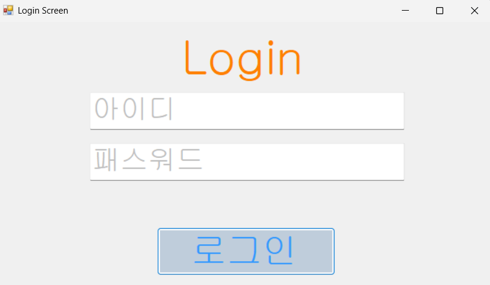
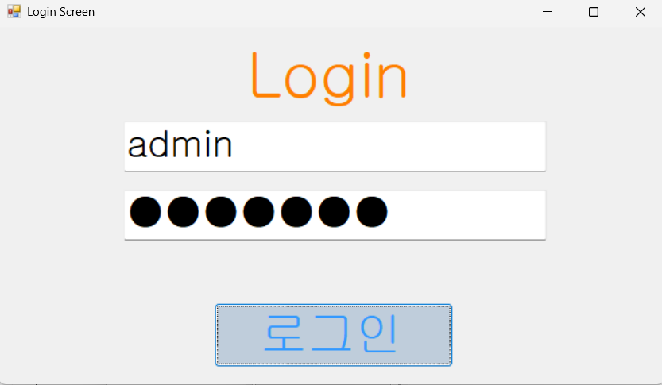
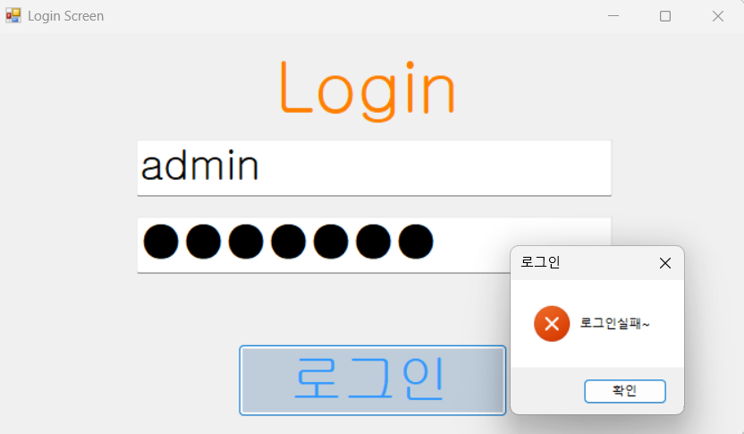
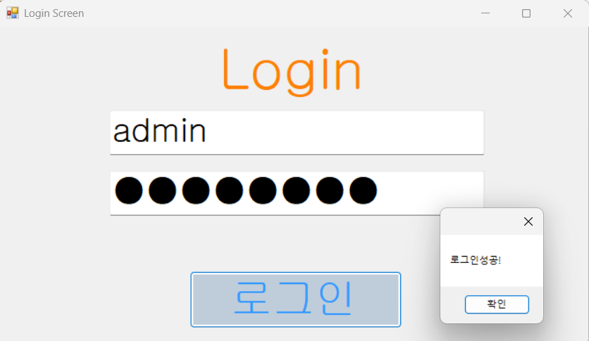
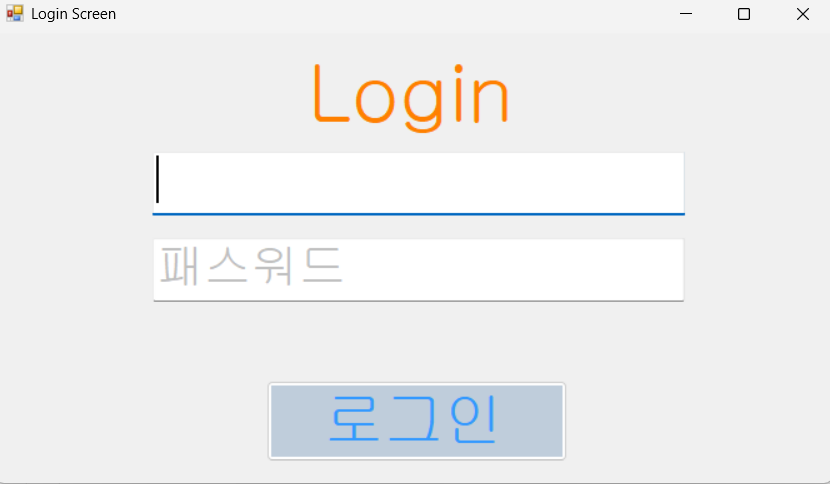
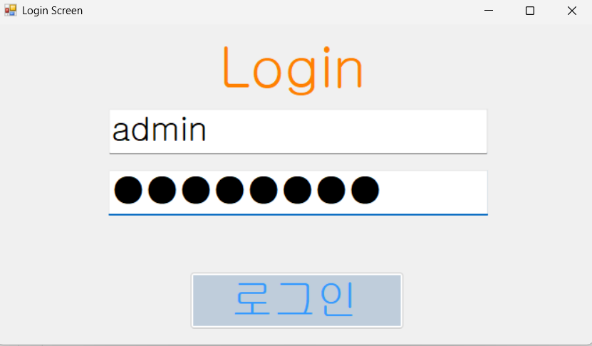
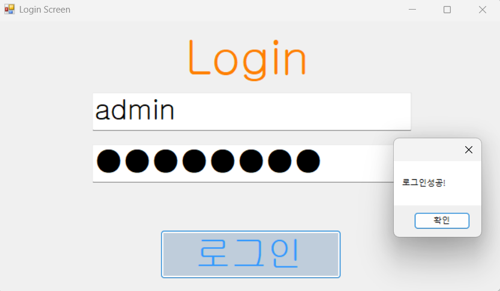
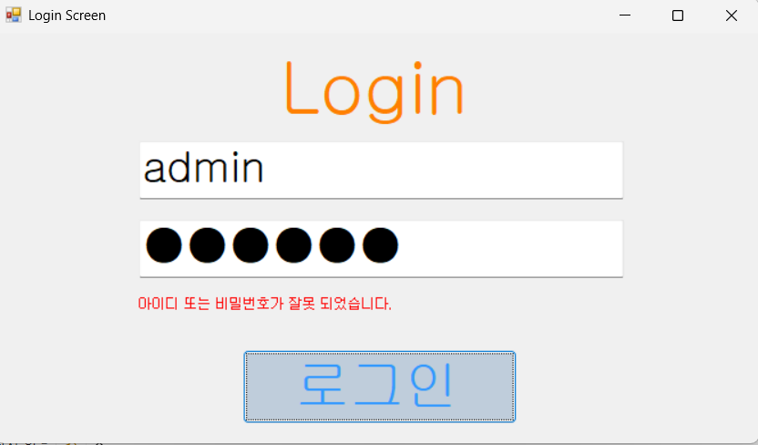

# (C# 코딩) LoginScreen

## 개요
- C# 프로그래밍학습
- 1줄소개: 사용자가 아이디와 비밀번호를 입력받으면 메시지를 띄우는 로그인 창 제작
- 사용한 플랫폼: 
    - C#, .NET Windows Forms, Visual Studio, GitHub
- 사용한 컨트롤:
    - Label, TextBox, Button
- 사용한 기술과 구현한 기능:
    - Visual Studio를 이용하여 UI 디자인
    - TextBox를 통하여 아이디와 비밀번호 입력 받기
    - Placeholder를 이용하여 힌트 텍스트 기능 구현

## 실행 화면 (과제1)
- 과제 1코드의 실행 스크린샷

- 과제내용
    - Label(표시), TextBox(입력), Button(전송), ListBox(대화창)를 적절히 배치합니다.
    - `MessageBox` 클래스를 통해 로그인 성공 및 실패여부를 출력합니다.
    - `KeyEventArgs` 클래스를 통해 키보드 입력 이벤트 처리 시 활용합니다. 
    - `TextBox` 사용자가 아이디와 비밀번호를 입력하는 입력 필드 역할을 합니다.
- 구현 내용과 기능 설명
    - placeholder 기능을 통하여 초기 상태에서 아이디 및 비밀번호가 회색으로 표시됩니다.
    - 비밀번호 입력 시 마스킹 처리가 되어 `●●●` 형태로 표시됩니다.
    - Enter키를 통하여 입력 커서가 변경되어 편의성을 제공하였습니다.
    - 탭 순서를 조절하여 `ButtonBox`에서 `TextBox`로 순서를 정하였습니다.

## 실행 화면 (과제2)
- 과제 1코드의 실행 스크린샷

- 과제내용
    - 아이디 혹은 비밀번호 오류 시 `Label` 출력 기능을 구현하였습니다.
    - 입력값이 일치 시 로그인 성공 및 정상 출력하도록 하였습니다.

- 구현 내용과 기능 설명
    - `lblErrorMsg.Visible = false;` 코드가 로그인 실패시 구현되도록 설정합니다.
    - Label 컨트롤을 추가하여 Text내용을 입력 후 visible 속성을 설정하였습니다.